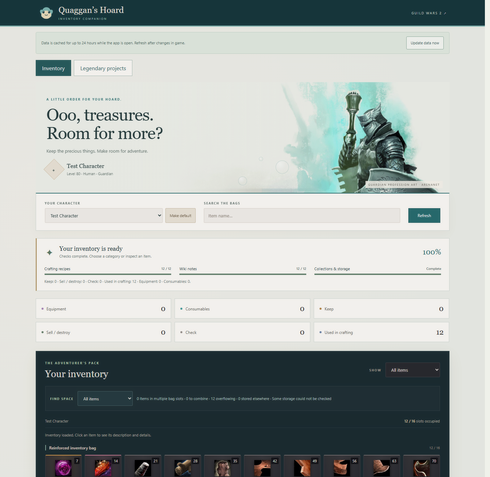
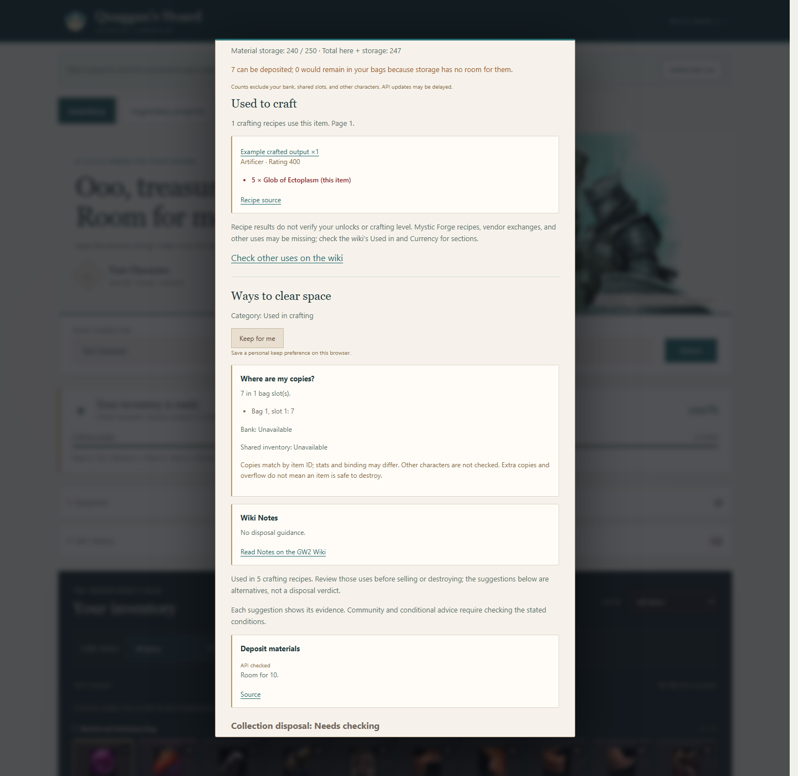
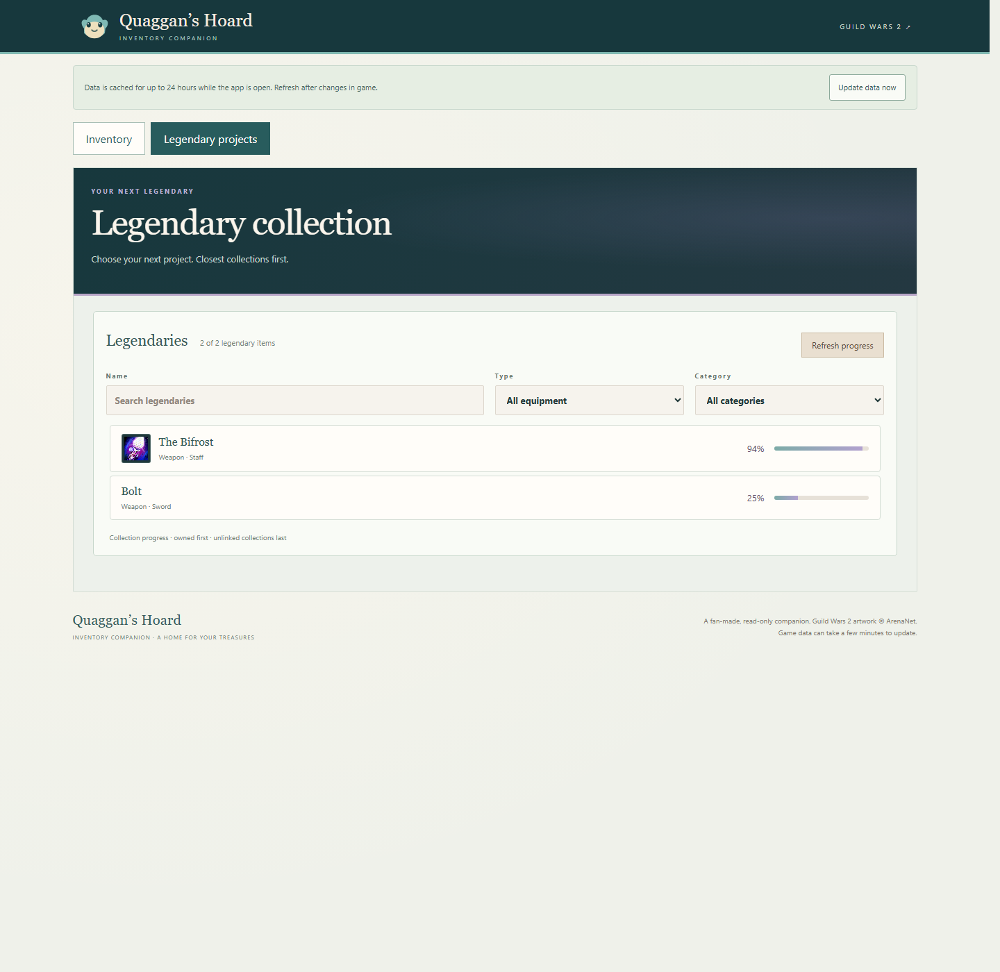
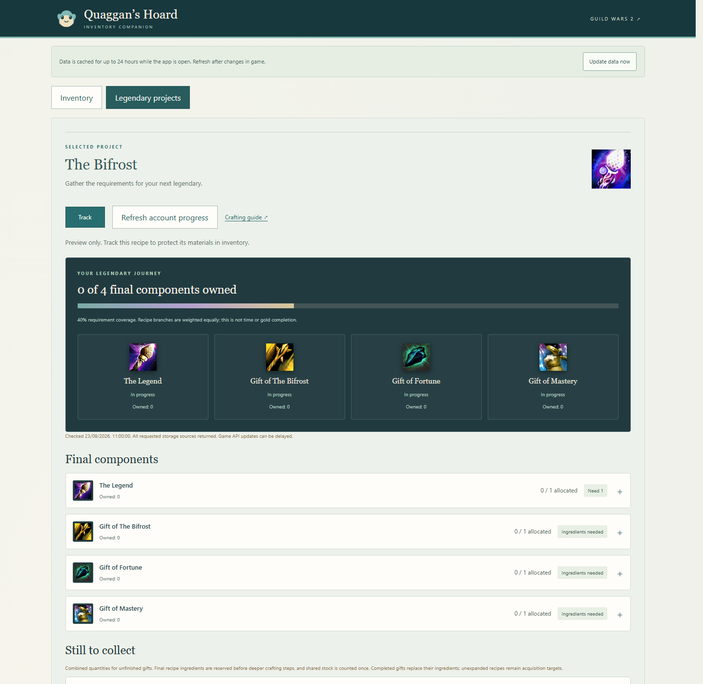
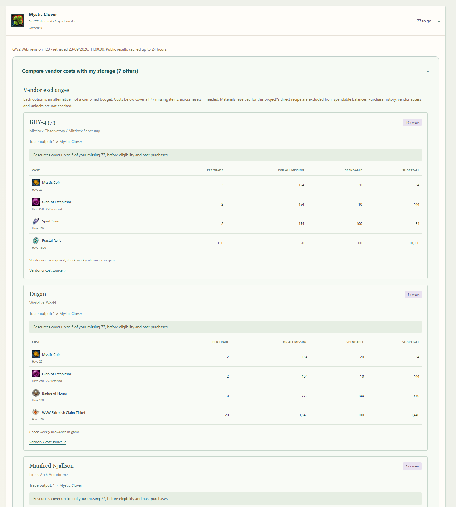

# Quaggan's Hoard

Quaggan's Hoard is a private, read-only Guild Wars 2 inventory companion. It helps you review a character's bags, understand what items are used for, find space, and track progress towards legendary equipment.


_Inventory view shown with demo data._

The app runs on your own computer. It never moves, sells, destroys, or crafts anything in your account.

## Install the Windows app

1. Open the [latest release](https://github.com/morses-code/quaggans-hoard/releases/latest).
2. Under **Assets**, download `QuaggansHoard-Setup-<version>.exe`.
3. Double-click the downloaded `.exe` and follow the setup wizard.
4. Open **Quaggan's Hoard** from the Start menu or its desktop shortcut.

The `.iss` file in the repository is installer source code for developers. You do not need it to install the app.

Windows may show an **Unknown publisher** warning because the current installer is not code-signed. Windows 10 or 11 x64 and the Microsoft Edge WebView2 Runtime are required. Most current Windows installations already include WebView2; if yours does not, download the [Evergreen Runtime from Microsoft](https://developer.microsoft.com/microsoft-edge/webview2/).

The portable `QuaggansHoard-Windows.zip` is also available on the release page. Extract the entire archive and run `QuaggansHoard.exe`; keep the `_internal` folder beside it.

## Connect your Guild Wars 2 account

Create an API key on the [ArenaNet Applications page](https://account.arena.net/applications) with these permissions:

- `account`
- `characters`
- `inventories`
- `progression`
- `wallet`

Paste the key into Quaggan's Hoard when prompted. In the Windows app it is kept in Windows Credential Manager for your Windows user and sent only to the official Guild Wars 2 API. Use **Account settings** to replace or forget it. The app does not store your ArenaNet password.

## User guide

### Review a character's inventory

1. Open the **Inventory** tab.
2. Choose a character. Use **Make default** if you want that character selected on future launches.
3. Wait for the crafting, wiki, collection, and storage checks to finish. You can browse the inventory while they load.
4. Select a category card or search by item name to narrow the list.
5. Click an item for its description, storage quantities, collection evidence, crafting uses, and matching copies elsewhere on the account.



_The item inspector shown with demo data._

| Category | Meaning |
| --- | --- |
| **Equipment** | Weapons, armour, trinkets, upgrades, and other equippable items. |
| **Consumables** | Food, boosters, containers, unlocks, and similar usable items. |
| **Keep** | The checks found a reason to retain the item. |
| **Sell / destroy** | Available evidence supports disposal or vendor advice. Read the item details before acting. |
| **Check** | The app could not reach a safe conclusion. Review this item manually. |
| **Used in crafting** | A Guild Wars 2 API recipe uses the item as an ingredient. |

Use **Find space** to highlight split stacks, material-storage overflow, and copies held in the bank, shared inventory, or another character. **Keep for me** in an item's details lets you protect an item from disposal suggestions.

Advice is intentionally cautious. Missing API data, unsupported Mystic Forge recipes, delayed achievement credit, or an incomplete wiki check can leave an item in **Check**. Always read the evidence before changing anything in game.

#### Understand an item's details

The inspector brings several checks together:

- **Find across account** searches every character's bags, the bank, shared inventory, and material storage for the same item ID. It shows where matching copies were found. Equipped items and guild storage are not included, and matching IDs can still have different bindings or stats.
- **What do I have?** compares the selected character's stack with material storage. It calls out full storage and the quantity that would remain in the bag.
- **Used to craft** lists crafting-station recipes returned by the official recipe API, including the output, discipline, rating, ingredients, and recipe source. Mystic Forge and vendor recipes may come from the wiki instead and are not guaranteed to appear here.
- **Ways to clear space** explains the assigned category, personal protection, bag locations, wiki notes, collection checks, and each suggested action. Evidence such as **API checked** tells you why the suggestion appeared.



_The lower part of the item inspector, shown with demo data._

Links labelled **Source**, **Recipe source**, **Verified item source**, or **GW2 Wiki** open the evidence used by the check. A link is supporting information rather than permission to discard an item. If a source fails, the app reports it as unavailable and keeps the result cautious.

### Track a legendary project



_Legendary catalogue shown with demo data._

1. Open **Legendary projects**.
2. Search by name or filter by equipment type and weapon category.
3. Select a legendary to load its requirements and account progress.
4. Click **Track** to protect known project materials in the inventory view.
5. Expand a missing material to see acquisition methods, vendor exchanges, costs, holdings, and any known shortfall.

Project quantities combine material storage, bank, shared inventory, character bags, and the Legendary Armory where applicable. Collection progress and crafting progress measure different things, so their percentages may differ.



_A selected legendary and its requirement tree, shown with demo data._

The project screen separates three kinds of progress:

- The catalogue percentage comes from reliably linked achievement objectives. It helps sort likely projects but does not measure the full crafting cost.
- **Requirement coverage** allocates the items currently found across your account to the selected recipe tree. Stock is counted once, completed gifts replace their ingredients, and the final recipe is reserved before deeper steps.
- Each requirement shows its owned, allocated, required, and missing quantities. Expand final components to inspect their nested recipe branches, or expand an item under **Still to collect** to investigate how to obtain it.

Clicking **Track** saves the selected legendary and recipe as your active project. Known required item types are then protected in the inventory view. Tracking does not reserve, craft, purchase, or move anything in Guild Wars 2.

#### Find missing legendary materials

Expanded materials can show vendor exchanges, reward tracks, gathering sources, map rewards, containers, achievements, and notes when those sections can be read reliably from the Guild Wars 2 Wiki.



_Mystic Clover vendor exchanges, account balances, and wiki sources shown with demo data._

For a vendor exchange, the app shows:

- the output and purchase limit reported by the wiki;
- the cost for one trade and for your entire missing quantity;
- the amount found in item storage or your wallet;
- materials already reserved for direct project requirements;
- the remaining shortfall and how many purchases your resources can support.

Each offer is an alternative calculation. The app does not combine offers into a purchase plan, check previous purchases, verify access to the vendor, or perform a transaction. Read the linked vendor source and in-game conditions before spending anything.

## Where the information comes from

| Source | Used for |
| --- | --- |
| [Official Guild Wars 2 API](https://api.guildwars2.com/v2) | Characters, inventories, bank, shared inventory, material storage, wallet, item definitions, crafting recipes, achievements, and Legendary Armory ownership. |
| [Guild Wars 2 Wiki](https://wiki.guildwars2.com) | Item notes, disposal wording, acquisition methods, Mystic Forge information, vendor exchanges, limits, and source conditions that are not available through the game API. |
| Your local preferences | Default character, **Keep for me** items, and the legendary project you chose to track. |

Wiki information is matched back to the official item ID before it is used. Imported text and tables are displayed as data; the app does not execute wiki page code. Wiki-derived panels include the page or section link, revision information where available, contributor attribution, and licence link.

Legendary catalogues and recipe trees are derived at runtime from the current Legendary Armory catalogue, official recipes, and item-matched wiki recipes. Cleanup collection relationships are derived from the current achievement catalogue and account progress. The application does not ship fixed legendary recipe trees or item-specific cleanup rule files.

Public API and wiki information can be incomplete or delayed. The app treats unavailable checks as unknown rather than zero and never claims that every possible use has been found.

### Refresh account data

Successful API and wiki responses are cached for up to 24 hours while the app is open. After moving items, crafting, or completing a collection, use **Update data now** to clear the cache and reload the current view. Guild Wars 2 API data can still take a few minutes to reflect an in-game change.

## Run from source as a local web server

This route needs Python 3.10 or newer and does not install any Python packages.

1. Clone or download this repository.
2. Copy `.env.example` to `.env`.
3. Add your key to `.env`:

   ```dotenv
   GW2_API_KEY=your_key_here
   ```

4. From the repository folder, start the server:

   ```powershell
   python server.py
   ```

5. Open [http://127.0.0.1:8000](http://127.0.0.1:8000).

The server listens only on your computer. `.env` is excluded from Git. An existing `GW2_API_KEY` environment variable takes precedence over the file. Stop the server with `Ctrl+C` in its terminal.

## Troubleshooting

- **The app does not open:** install or repair Microsoft Edge WebView2 Runtime, then try again.
- **Characters or account data are missing:** confirm the API key has all five permissions listed above, then replace it in Account settings.
- **Recent changes are not visible:** select **Update data now** and allow a few minutes for the Guild Wars 2 API to catch up.
- **A check failed:** confirm internet access and retry. Failed sources remain unknown rather than being treated as empty.

## Development

Run the automated tests with:

```powershell
python -m unittest discover -s tests -v
```

Windows build, packaging, release, and security details are documented in [WINDOWS.md](WINDOWS.md). Artwork attribution is in [public/art/SOURCES.md](public/art/SOURCES.md).

Quaggan's Hoard is a fan-made tool and is not affiliated with ArenaNet. Guild Wars 2 and its artwork are trademarks or property of their respective owners.
